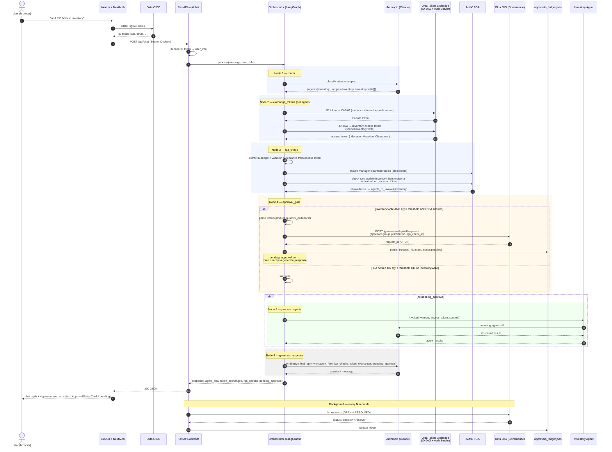

# ProGear Sales AI — End-to-End Sequence Diagram

Traced from the current code in `backend/orchestrator/orchestrator.py`, `backend/auth/multi_agent_auth.py`, `backend/auth/fga_client.py`, and `backend/services/approval_service.py`.

The pipeline is a LangGraph state machine with six nodes:

```
router → exchange_tokens → fga_check → approval_gate
       ├─(pending_approval set)─→ generate_response → END
       └─(otherwise)──────────→ process_agents → generate_response → END
```



## Notes worth highlighting

- **`exchange_tokens` runs before `fga_check`.** The FGA decision uses claims from the per-agent auth-server access token (`Manager`, `Vacation`, `Clearance`) — not from the user's ID token.
- **`approval_gate` respects FGA.** If FGA already denied the inventory agent, the gate skips OIG creation so we don't queue an approval for an unauthorized action (`orchestrator.py:577–587`).
- **Approval short-circuits agent execution.** `_route_after_approval` (line 209) routes straight to `generate_response` when `pending_approval` is set, so the inventory agent never runs until the OIG request resolves.
- **Vacation is contextual, not stored.** Persistent FGA tuples = managers + clearance. Vacation comes from the Okta access-token claim and is passed as a contextual tuple per request.
- **Out-of-band reconciliation.** `approvals_ledger.json` plus a background poller in `api/main.py` reconcile OIG decisions (`OPEN` and `RESOLVED`) so the UI eventually reflects approver action without the user re-prompting.
